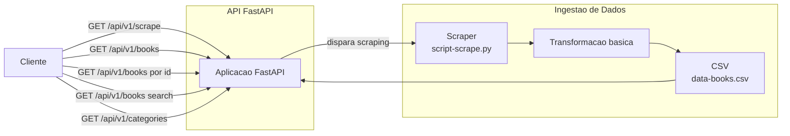
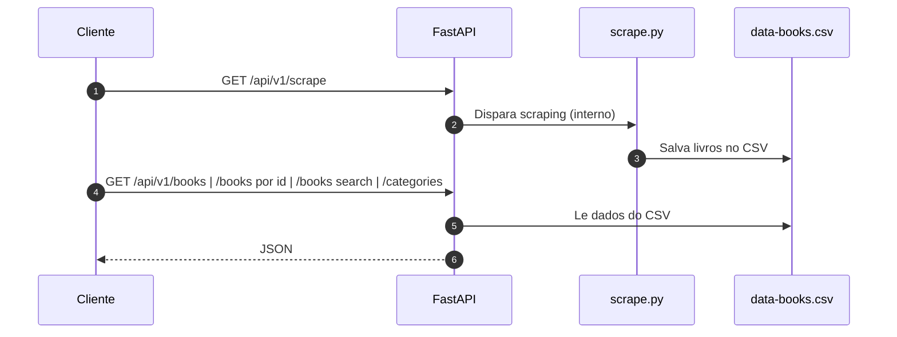

# Tech Challenge — Book Scraper API

Este projeto contém um pequeno serviço em FastAPI que executa um scraping do site "Books to Scrape" em background e expõe endpoints para consultar os livros coletados, categorias e métricas simples.

- Linguagem: Python 3.10+ (teste em Python 3.11)
- Framework web: FastAPI
- Link do video no youtube: https://youtu.be/c63iWU-syak
- Link do deploy: https://fiap-7-mlet.vercel.app/docs


## Arquitetura

- `app.py` — wrapper principal que configura o aplicativo FastAPI, inicia o scraper em background no evento `startup`.
- `api/v1/` — roteadores da API (books, categories, health, stats).
- `script/scrape.py` — lógica de scraping que extrai dados do site alvo.
- `/tmp/data/books.csv` — Arquivo CSV com dados coletados (somente gerado pelo script).

O scraper é executado em uma thread daemon ao iniciar a aplicação e popula `app.state.books`. Os endpoints leem deste estado em memória para responder às requisições.


## Requisitos

Instale as dependências do projeto:

```bash
python -m pip install -r requirements.txt
```


## Instalação e configuração

1. Clone o repositório.
2. Crie e ative um ambiente virtual (recomendado):

```bash
python -m venv .venv
source .venv/bin/activate
pip install -r requirements.txt
```

## Executando a aplicação

Modo rápido (executa `uvicorn` internamente):

```bash
python app.py
```

Ou usando `uvicorn` diretamente (útil para desenvolvimento):

```bash
uvicorn app:app --host 0.0.0.0 --port 8000 --reload
```

Ao iniciar, a aplicação dispara o scraping do site alvo em background; enquanto o scraping não terminar, o endpoint de health indica `scraping_in_progress: true`.


## Rotas da API (v1)

Base da API: `/api/v1`

- **GET /api/v1/health/**
  - Descrição: Retorna status simples da aplicação, timestamp UTC e número de livros carregados.
  - Response (200):

```json
{
  "status": "ok",
  "time": "2025-11-03T12:00:00Z",
  "book_count": 234,
  "scraping_in_progress": false
}
```

- **GET /api/v1/books**
  - Descrição: Lista todos os livros carregados. Suporta ordenação interna (por rating/título internamente).
  - Query params suportados (implementação atual aceita filtros por título/categoria via `/search` — ver abaixo).
  - Response (200): lista de objetos `Book`.

Exemplo de objeto `Book`:

```json
{
  "id": 1,
  "titulo": "A Light in the Attic",
  "preco": 51.77,
  "rating": 3,
  "disponibilidade": "In stock",
  "categoria": "Poetry",
  "imagem_url": "http://.../image.jpg"
}
```

- **GET /api/v1/books/search?title=...&category=...**
  - Descrição: Busca por substring no título (`title`) e por categoria exata (`category`).
  - Exemplo: `/api/v1/books/search?title=attic&category=Poetry`

- **GET /api/v1/books/top-rated**
  - Descrição: Retorna livros ordenados por rating (desc).

- **GET /api/v1/books/price-range?min=10&max=50**
  - Descrição: Filtra livros cujo preço esteja no intervalo `[min, max]`.

- **GET /api/v1/books/{book_id}**
  - Descrição: Retorna um livro pelo `id` (inteiro). Retorna 404 se não encontrado.

- **GET /api/v1/categories/**
  - Descrição: Lista categorias e contagem de livros por categoria, ordenadas por quantidade (desc).
  - Response (200) exemplo:

```json
[ { "categoria": "Poetry", "count": 34 }, { "categoria": "Travel", "count": 12 } ]
```

- **GET /api/v1/stats/overview**
  - Descrição: Estatísticas gerais: `total_books`, `average_price`, `ratings_distribution`.

- **GET /api/v1/stats/categories**
  - Descrição: Estatísticas por categoria: `count`, `average_price`, `min_price`, `max_price`, `average_rating`.

## Exemplos de chamadas (curl)

- Docs:

```bash
curl -s https://fiap-7-mlet.vercel.app/docs/
```

- Health:

```bash
curl -s https://fiap-7-mlet.vercel.app/api/v1/health/
```

- Listar livros (todos):

```bash
curl -s https://fiap-7-mlet.vercel.app/api/v1/books
```

- Buscar por título e categoria:

```bash
curl -s "https://fiap-7-mlet.vercel.app/api/v1/books/search?title=attic&category=Poetry"
```

- Top rated (top 5):

```bash
curl -s "https://fiap-7-mlet.vercel.app/api/v1/books/top-rated"
```

- Estatísticas overview:

```bash
curl -s https://fiap-7-mlet.vercel.app/api/v1/stats/overview
```

- Disparar scraping:

```bash
curl -s https://fiap-7-mlet.vercel.app/api/v1/scrape
```

## Observações operacionais

- Há também um endpoint que dispara o scraping de forma síncrona (usa `script/scrape.py` e retorna os livros): **GET /api/v1/scrape/**. Atenção: este endpoint executa o processo de scraping dentro da mesma requisição e pode demorar o tempo necessário para coletar todas as páginas — em plataformas serverless (ex.: Vercel) isso pode exceder timeouts.

## Fluxograma



## Diagrama de Sequência


